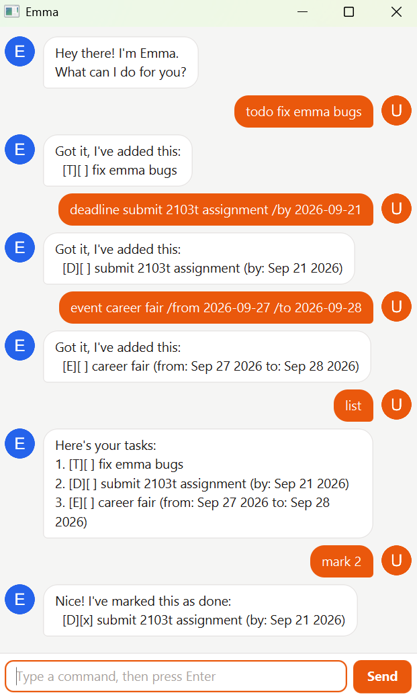

# Emma User Guide

Emma is a friendly chatbot that keeps track of your tasks — things to do, things
due by a date, and things happening over a few days. Tell her what's on your
plate, and she remembers it, including after you close her.



## Getting started

1. Install **Java 25** if you don't already have it.
2. Download `emma.jar` and put it in a folder of its own.
3. Double-click it, or run `java -jar emma.jar` from a terminal.

Type a command in the box at the bottom and press <kbd>Enter</kbd>, or click
**Send**.

> [!TIP]
> Emma saves after every change, so you can close her whenever you like without
> losing anything.

## Adding tasks

Emma tracks three kinds of task.

**Something to do, with no particular date:**

```
todo buy milk
```

```
Got it, I've added this:
  [T][ ] buy milk
```

**Something due by a date:**

```
deadline submit report /by 2026-09-25
```

```
Got it, I've added this:
  [D][ ] submit report (by: Sep 25 2026)
```

**Something running over a stretch of days:**

```
event team offsite /from 2026-10-02 /to 2026-10-03
```

```
Got it, I've added this:
  [E][ ] team offsite (from: Oct 02 2026 to: Oct 03 2026)
```

> [!NOTE]
> Type dates as **`yyyy-mm-dd`**. Emma reads them back to you in words.

## Seeing what you have

`list` shows everything, numbered:

```
Here's your tasks:
1. [T][x] buy milk
2. [D][ ] submit report (by: Sep 25 2026)
3. [E][ ] team offsite (from: Oct 02 2026 to: Oct 03 2026)
```

Each line reads `[kind][status] description`. The kind is `T`, `D` or `E` for the
three sorts of task, and the status is `x` once it's done.

## Ticking things off

Use the number shown by `list`:

| You type | What happens |
|---|---|
| `mark 2` | Task 2 is marked done |
| `unmark 2` | Task 2 goes back to not done |
| `delete 2` | Task 2 is removed for good |

## Finding a task

When the list gets long:

| You type | What you get |
|---|---|
| `find report` | Every task with "report" in its description |
| `filter /type deadline` | Only deadlines — or use `todo` or `event` |
| `filter /type deadline /due-by 2026-09-30` | Deadlines due on or before that date |
| `filter /type event /at 2026-10-02` | Events running on that day |

`find` matches part of a word, and it cares about capital letters — `find Report`
won't match "report".

## Finishing up

`bye` closes the window. Everything is already saved.

## All the commands

| Command | What it does | Example |
|---|---|---|
| `todo DESCRIPTION` | Adds a task with no date | `todo buy milk` |
| `deadline DESCRIPTION /by DATE` | Adds a task due by a date | `deadline submit report /by 2026-09-25` |
| `event DESCRIPTION /from START /to END` | Adds a task spanning dates | `event team offsite /from 2026-10-02 /to 2026-10-03` |
| `list` | Shows every task, numbered | `list` |
| `mark NUMBER` | Marks a task done | `mark 2` |
| `unmark NUMBER` | Marks a task not done | `unmark 2` |
| `delete NUMBER` | Removes a task | `delete 2` |
| `find TEXT` | Shows tasks containing that text | `find report` |
| `filter /type TYPE` | Shows one kind of task | `filter /type deadline` |
| `filter /type deadline /due-by DATE` | Deadlines due by a date | `filter /type deadline /due-by 2026-09-30` |
| `filter /type event /at DATE` | Events running on a date | `filter /type event /at 2026-10-02` |
| `bye` | Closes Emma | `bye` |

## Good to know

- **Emma won't add the same task twice.** If a task matches one you already have
  — same kind, same description, same dates — she'll say so and leave your list
  alone.
- **Nothing is lost when something goes wrong.** If Emma can't carry out a
  command, she says why in a red bubble and your tasks stay exactly as they were.
- **`list` and `bye` are typed on their own.** Anything after them is a typo as
  far as Emma is concerned, so she'll ask rather than guess.
- **Your tasks live in `data/emma.json`**, in the folder you ran Emma from. It's
  ordinary text, so you can read it — or back it up — yourself.
